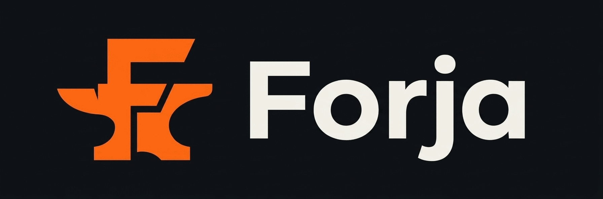

<div align="center">



</div>

# Forja

**App para coaches de gym y sus clientes**: rutinas asignadas, dietas, progreso, asistencia y control de pagos, presencial o a distancia.

> **Estado: en construcción.** Hoy este repositorio es openGym con el nombre cambiado. Las funciones de coach y cliente descritas abajo están diseñadas, no implementadas. El avance real está en [`odd/tasks.md`](odd/tasks.md).

## Basado en openGym

Forja es un fork de [**openGym**](https://github.com/DuarteSantos8/openGym), de Duarte Santos, un tracker de gimnasio autoalojado. De openGym viene todo lo que ya funciona: la librería de ejercicios, el planificador semanal, el workout guiado, las estadísticas y la PWA. Su README original se conserva en [`docs/upstream/README.openGym.md`](docs/upstream/README.openGym.md).

Lo que Forja añade encima es la capa de entrenador: cuentas con correo, relación coach–cliente, asignación de rutinas y dietas, métricas por cliente, asistencia y finanzas del coach.

## Qué va a hacer

| | Coach | Cliente |
|---|---|---|
| Rutinas | Crea plantillas y las asigna | Ejecuta su rutina con workout guiado |
| Dietas | Asigna planes de comidas | Ve su dieta del día |
| Progreso | Ve métricas de cada cliente | Carga sus parámetros y ve su comparativa |
| Asistencia | Marca sesiones presenciales | Confirma y ve su historial |
| Pagos | Lleva mensualidades y vencidos | Ve el estado de su mensualidad |

Planes del servicio alojado: **Free** (hasta 5 clientes) y **Pro** (clientes ilimitados, dietas, métricas comparativas y finanzas). El código es el mismo y es libre; el plan Pro financia servidor y dominio.

## Stack

- Frontend: React 19 + Vite, PWA (heredado de openGym).
- API: Node (heredado de openGym), en migración a funciones serverless.
- Destino: Vercel + Supabase (Auth, Postgres, Storage).

## Correr en local

Por ahora se ejecuta igual que openGym:

```bash
docker compose up -d
```

Para desarrollo del frontend:

```bash
cd frontend
npm ci
npm test
npm run dev
```

## Documentación

- Diseño: [`docs/superpowers/specs/2026-10-06-forja-design.md`](docs/superpowers/specs/2026-10-06-forja-design.md)
- Tareas y evidencia: [`odd/tasks.md`](odd/tasks.md)
- Privacidad: [`docs/legal/PRIVACIDAD.md`](docs/legal/PRIVACIDAD.md) · Términos: [`docs/legal/TERMINOS.md`](docs/legal/TERMINOS.md) (borradores)
- Documentación heredada de openGym: [`docs/`](docs/)

## Privacidad

Los datos de los usuarios se usan solo para operar y mejorar Forja. No se venden ni se ceden, y no hay publicidad ni rastreadores de terceros.

## Licencia y créditos

Forja se distribuye bajo **GNU AGPL-3.0**, la misma licencia de openGym, de la que es obra derivada. Ver [`LICENSE`](LICENSE) y [`NOTICE.md`](NOTICE.md).

- openGym — Copyright (C) 2026 Duarte Santos.
- Modificaciones de Forja — Copyright (C) 2026 Carlos Ávila.

Los datos e imágenes de ejercicios son de terceros y tienen sus propias condiciones, detalladas en `NOTICE.md`.
