<div align="center">


**La app para entrenadores personales y sus clientes.**
Gimnasio, vínculo coach–cliente, medidas y progreso: en el teléfono y en la computadora.

[**Probar Forja →**](https://forja-trainer.vercel.app) · [Novedades](https://github.com/AvilaCarlosDev/Forja/releases) · [Plan del proyecto](docs/PLAN.md)

   

<br>

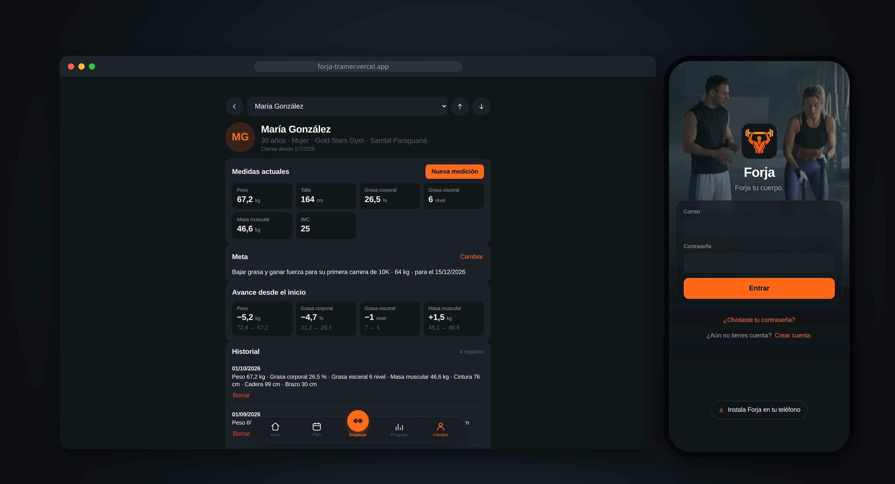

</div>

## Qué hace hoy

| | Entrenador | Cliente |
|---|---|---|
| **Cuenta** | Correo y contraseña, con confirmación por correo | Igual; menores de 18 con permiso de madre, padre o tutor |
| **Gimnasio** | Elige uno o varios donde trabaja | Elige el suyo, o «entreno en casa» |
| **Vínculo** | Recibe la solicitud como notificación y acepta o rechaza | Elige a su entrenador entre los de su gimnasio y puede cambiarlo |
| **Medidas** | Carga peso, talla, grasa corporal y visceral, masa muscular, perímetros y meta | Las ve en solo lectura; sin entrenador, carga lo básico él mismo |
| **Historial** | Al recibir a un cliente, ve todo lo que trae de su entrenador anterior | Su historial lo acompaña siempre |
| **Plan** | Free: hasta 5 clientes · Pro: ilimitados y comparativa de progreso | Nunca paga |

Además, todo lo que trae openGym: más de 1.300 ejercicios, planificador semanal, entrenamiento guiado y estadísticas.

**Lista inicial de gimnasios de Punto Fijo**, cada uno con fuente oficial: Gold Stars Gym (Sambil Paraguaná, Las Virtudes y Ciudad del Viento), Altitude y New Life Training Center. Si falta el tuyo, lo agregas desde la app con su Instagram o una foto del logo ([fuentes](docs/research/gimnasios-punto-fijo.md)).

## Cómo se ve

### En el teléfono

<table>
<tr>
<td align="center" width="25%">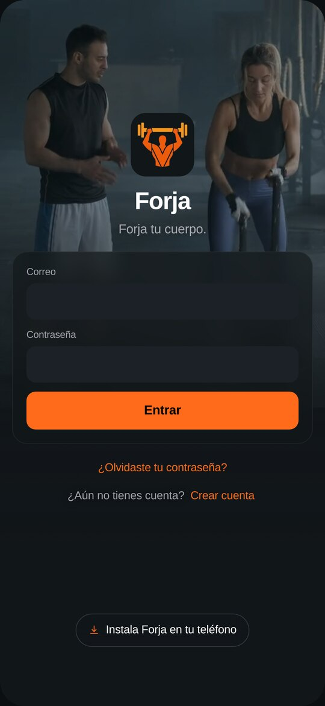<br><sub>Entrar</sub></td>
<td align="center" width="25%">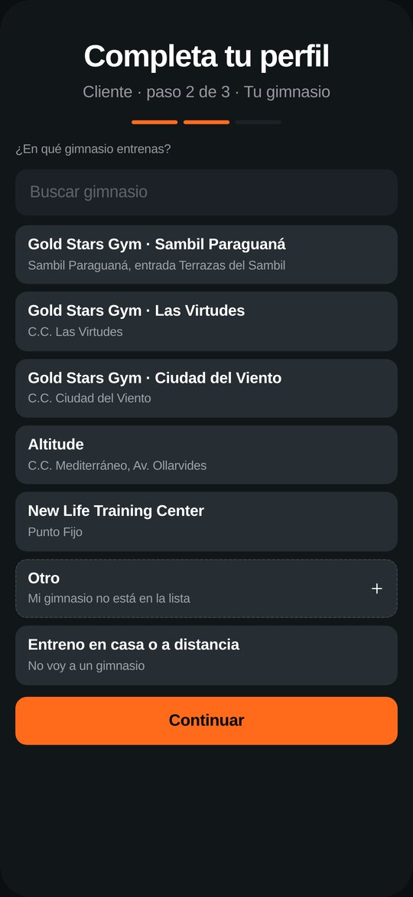<br><sub>Elegir gimnasio</sub></td>
<td align="center" width="25%">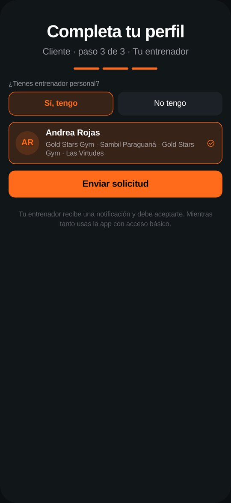<br><sub>Elegir entrenador</sub></td>
<td align="center" width="25%">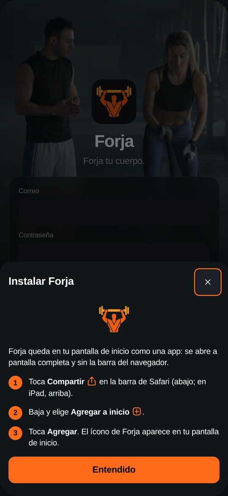<br><sub>Instalar como app</sub></td>
</tr>
<tr>
<td align="center">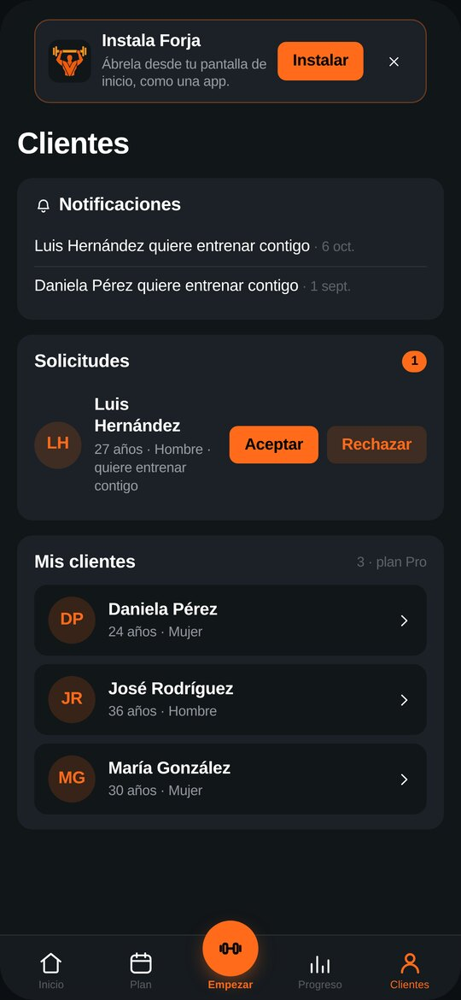<br><sub>Clientes (entrenador)</sub></td>
<td align="center">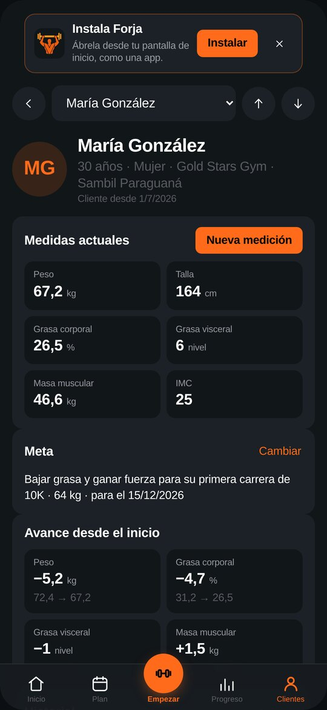<br><sub>Ficha del cliente</sub></td>
<td align="center">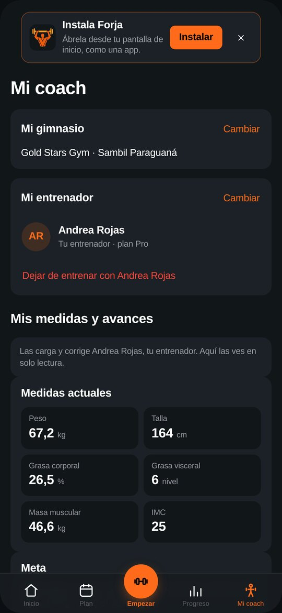<br><sub>Mi coach (cliente)</sub></td>
<td align="center">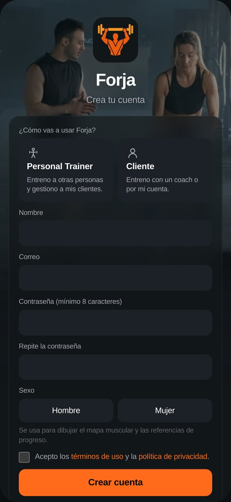<br><sub>Crear cuenta</sub></td>
</tr>
</table>

### En la computadora

<table>
<tr>
<td width="50%">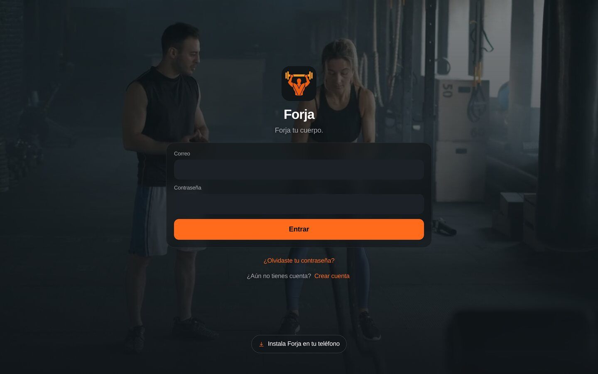</td>
<td width="50%">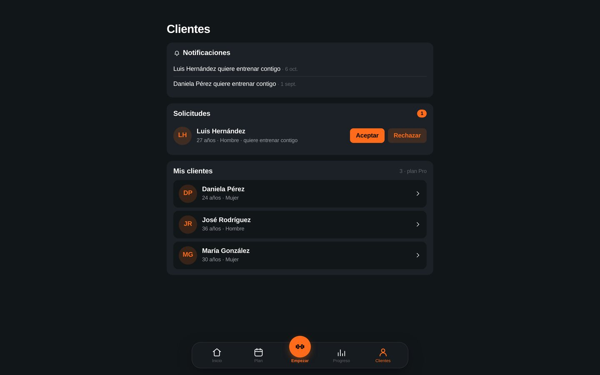</td>
</tr>
<tr>
<td>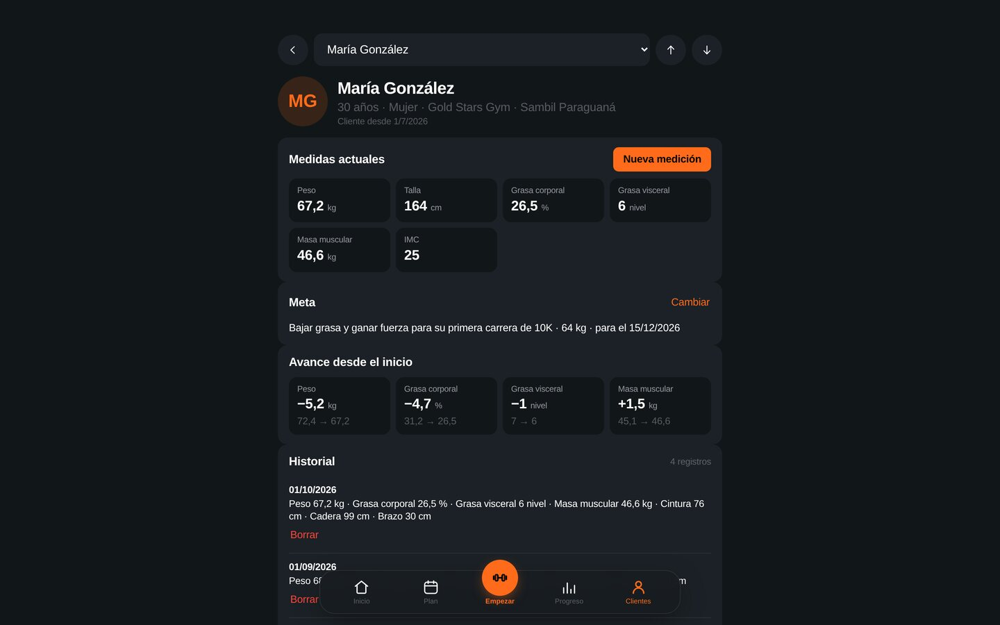</td>
<td>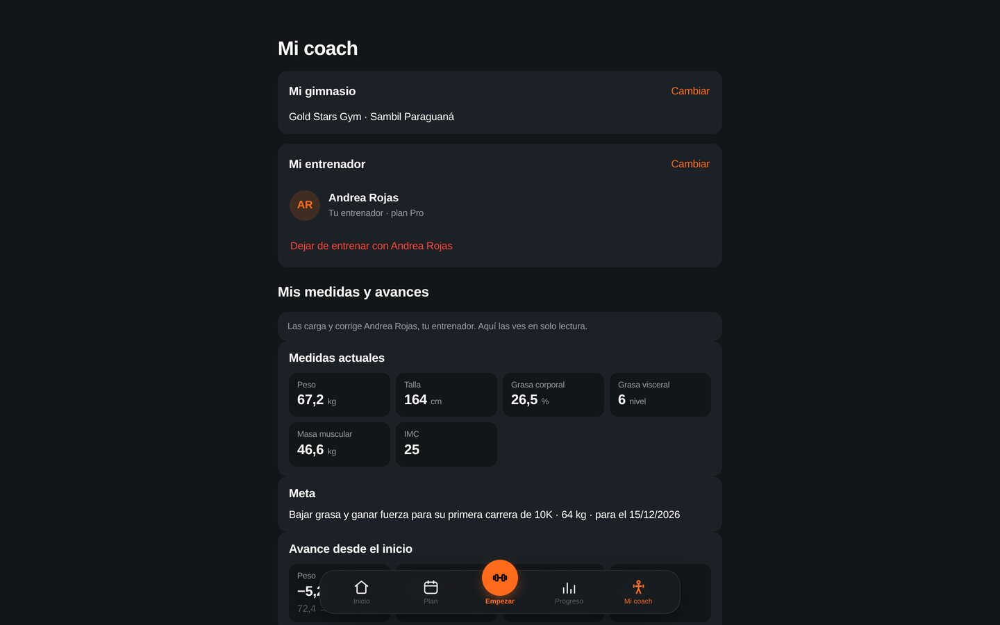</td>
</tr>
</table>

<sub>Capturas de la versión 0.6 con datos de ejemplo. Se regeneran con <code>scripts/forja-screenshots.mjs</code>.</sub>

## Instálala en tu teléfono

Forja es una app web instalable (PWA): no hace falta tienda.

- **iPhone (Safari):** Compartir → **Agregar a inicio**.
- **Android (Chrome):** botón **Instalar Forja** en la pantalla de entrada, o menú ⋮ → **Instalar app**.

## Privacidad y seguridad

- Los datos se usan solo para operar y mejorar Forja. No se venden ni se ceden; sin publicidad ni rastreadores.
- Cada tabla tiene **seguridad por fila** en Postgres: un entrenador solo ve a sus clientes activos, y el anterior pierde el acceso al cambiar de entrenador. Las reglas tienen pruebas automáticas que corren contra la base ([`supabase/tests`](supabase/tests)).
- Fotos de perfil en almacenamiento privado, una carpeta por persona.

## Stack

| Capa | Tecnología |
|---|---|
| Frontend | React 19 + Vite, PWA (heredado de openGym), sin SDK de Supabase: REST con `fetch` |
| Cuentas y datos | Supabase: Auth, Postgres con RLS, Storage |
| Hosting | Vercel |
| Pruebas | Vitest (3.200+ tests) y pruebas de permisos SQL en Supabase y en PGlite |

## Desarrollo

```bash
cd frontend
npm ci
npm test           # usar Node 22 (con Node 26 fallan tests en falso por localStorage)
npm run dev
```

Vista previa sin servidor (cuentas y datos de ejemplo en el navegador):

```bash
VITE_FORJA_AUTH_PREVIEW=1 npx vite
```

Base de datos: las migraciones están en [`supabase/migrations`](supabase/migrations) y se aplican en orden en el editor SQL de Supabase. Para probar los permisos en local: `node supabase/tests/run-local.mjs` (con PGlite instalado).

## Documentación

- [Plan del proyecto por fases](docs/PLAN.md) · [Tareas y evidencia](odd/tasks.md)
- [Diseño](docs/superpowers/specs/2026-10-06-forja-design.md) · [Video de entrada](docs/design/login-video.md)
- [Privacidad](docs/legal/PRIVACIDAD.md) · [Términos](docs/legal/TERMINOS.md) (borradores)

## Basado en openGym

Forja es un fork de [**openGym**](https://github.com/DuarteSantos8/openGym), de Duarte Santos, un tracker de gimnasio autoalojado. De openGym vienen la librería de ejercicios, el planificador semanal, el workout guiado, las estadísticas y la PWA. Su README original se conserva en [`docs/upstream/README.openGym.md`](docs/upstream/README.openGym.md). Forja añade la capa de entrenador: cuentas, gimnasios, vínculo coach–cliente, medidas y planes.

## Licencia y créditos

Forja se distribuye bajo **GNU AGPL-3.0**, la misma licencia de openGym, de la que es obra derivada. Ver [`LICENSE`](LICENSE) y [`NOTICE.md`](NOTICE.md).

- openGym — Copyright (C) 2026 Duarte Santos.
- Modificaciones de Forja — Copyright (C) 2026 Carlos Ávila.
- Video de la pantalla de entrada: [Mixkit](https://mixkit.co/free-stock-video/mature-woman-working-out-with-her-trainer-47023/), licencia libre de Mixkit.

Los datos e imágenes de ejercicios son de terceros y tienen sus propias condiciones, detalladas en `NOTICE.md`.
